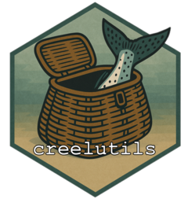

# creelutils <a href="https://wdfw-fp.github.io/creelutils/"></a>

<!-- badges: start --> [](https://lifecycle.r-lib.org/articles/stages.html#experimental) [](https://github.com/wdfw-fp/creelutils/actions/workflows/R-CMD-check.yaml) <!-- badges: end -->

A R package for working with freshwater recreational creel data. This package contains a variety of utility functions which are considered general use and might be applicable in various places of a workflow. It also contains functions which perform a utility process; for example, the group of functions relating to the extract, transform, and load (ETL) process for uploading model estimates to the creel database.

## Installation

`creelutils` can be installed from GitHub with the `remotes` package. 

``` r
install.packages("remotes")
remotes::install_github("wdfw-fp/creelutils")
```

### Prerequisites and Troubleshooting

- As GitHub is a source code repository, installation requires [Rtools](https://cran.r-project.org/bin/windows/Rtools/). To verify your C++ toolchain is functional, run `pkgbuild::has_build_tools(debug = TRUE)`. If it returns `TRUE`, Rtools is properly configured.

- Netskope can interfere with secure connections to GitHub during source package downloads. If installation fails with SSL certificate or "cannot open URL" errors, try disconnecting from the VPN.

- To force a fresh reinstall when `remotes` reports the package is already up to date:

``` r
# unload if currently loaded (safe to skip if not)
detach("package:creelutils", unload = TRUE)

# remove and reinstall
remove.packages("creelutils")
remotes::install_github("wdfw-fp/creelutils", force = TRUE)
```
